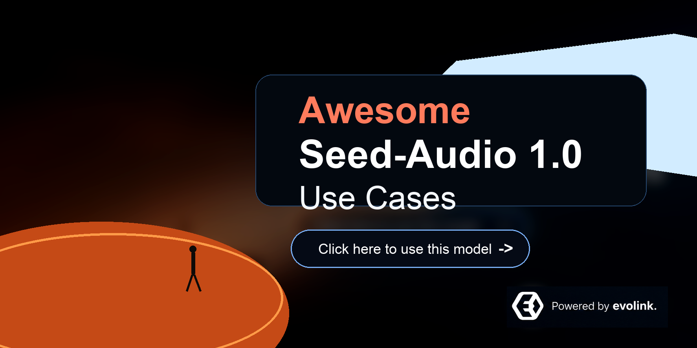
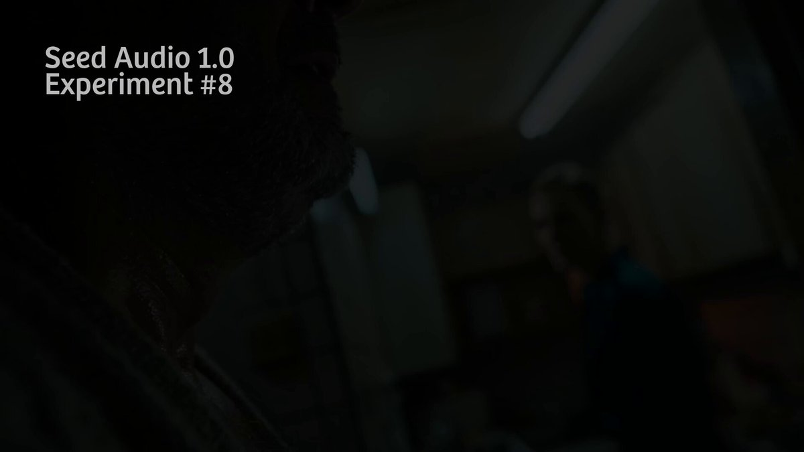
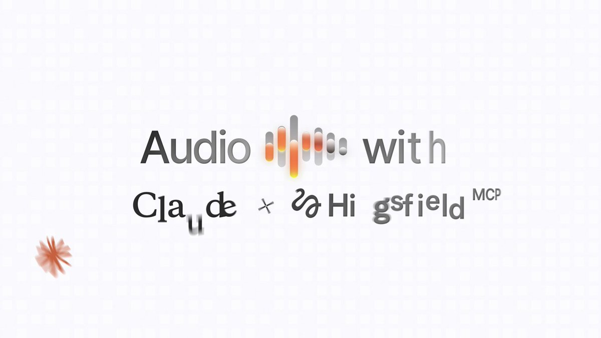
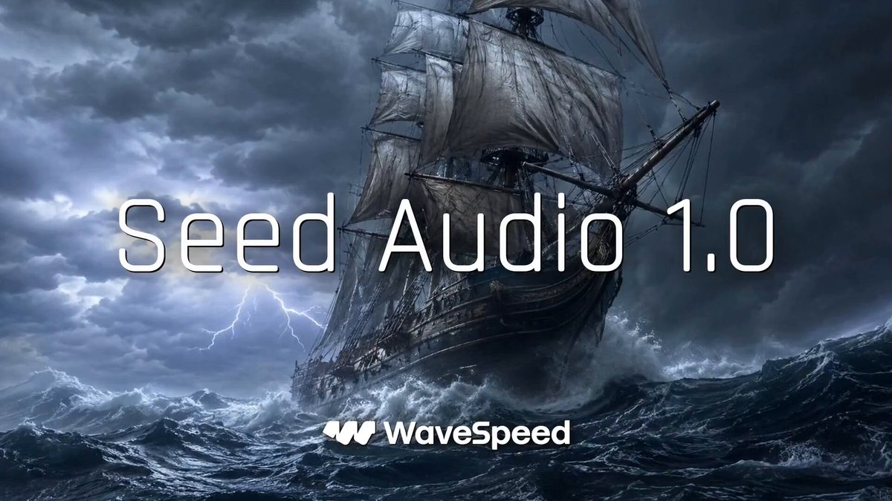

<div align="center">

<a href="https://evolink.ai/seed-audio-1-0?utm_source=github&utm_medium=banner&utm_campaign=awesome-seed-audio-1.0-usecases"></a>

[](LICENSE)
[](https://evolink.ai/seed-audio-1-0?utm_source=github&utm_medium=badge&utm_campaign=awesome-seed-audio-1.0-usecases)
[](https://evolink.ai/seed-audio-1-0?utm_source=github&utm_medium=badge&utm_campaign=awesome-seed-audio-1.0-usecases)
[](https://docs.evolink.ai/en/api-manual/audio-series/doubao-seed-audio/doubao-seed-audio-1-0?utm_source=github&utm_medium=readme&utm_campaign=awesome-seed-audio-1.0-usecases)

[](README.md) [](README_es.md) [](README_pt.md) [](README_ja.md) [](README_ko.md) [](README_de.md) [](README_fr.md) [](README_tr.md) [](README_zh-TW.md) [](README_zh-CN.md) [](README_ru.md)

</div>

# Seed-Audio 1.0 使用案例：旁白、音訊劇、參考聲音與音訊優先影片工作流

## 介紹

歡迎來到 Seed-Audio 1.0 高訊號使用案例倉庫。

**我們基於公開 X/Twitter 來源和 EvoLink 文件，整理 Seed-Audio 1.0 的真實使用案例、創作者工作流、平台整合、評估與實務限制。**

本繁體中文 README 保留公開來源連結、作者署名和錨點，同時翻譯使用者可見說明文字。

[在 EvoLink 上試用 Seed-Audio 1.0](https://evolink.ai/seed-audio-1-0?utm_source=github&utm_medium=readme&utm_campaign=awesome-seed-audio-1.0-usecases)

## 總覽

- **從近期 X/Twitter 樣本中篩選出 12 個 Seed-Audio 1.0 使用案例，原始可用樣本為 93 則。**
- 涵蓋方向：音訊優先影片工作流, 音訊劇與場景生成, 參考聲音與角色配音探索, 工具與服務商整合, 社群旁白、擬音與成本測試。
- 每個案例都包含原始來源、創作者署名、使用結論、證據類型與發布日期。
- 你可以用這個倉庫查找真實工作流、比較優勢和限制、發現服務商路徑，並把實作工作導向 EvoLink。

> [!NOTE]
> 本地化 README 與英文源文件保持相同的案例順序、連結、錨點與署名。

> [!NOTE]
> 本倉庫優先收錄具體工作流證據，而不是純宣傳：演示、設定說明、服務商發布、上手評估和明確限制。

[更新日誌](docs/update-log.md) | [維護指南](docs/maintenance.md) | [案例資料](data/use-cases.json) | [預設音色文件](https://docs.evolink.ai/en/api-manual/audio-series/doubao-seed-audio/doubao-seed-audio-1-0-voices)

## API 快速存取

透過 EvoLink 音訊生成 API 使用 Seed-Audio 1.0。先在 [EvoLink](https://evolink.ai/seed-audio-1-0?utm_source=github&utm_medium=readme&utm_campaign=awesome-seed-audio-1.0-usecases) 取得 API key，然後在請求前設定 `EVOLINK_API_KEY`。

```bash
export EVOLINK_API_KEY="your_api_key_here"

curl --request POST \
  --url https://api.evolink.ai/v1/audios/generations \
  --header "Authorization: Bearer ${EVOLINK_API_KEY}" \
  --header "Content-Type: application/json" \
  --data '{
    "model": "doubao-seed-audio-1-0",
    "prompt": "Create a 15-second calm product video audio bed with soft music, a clean studio ambience, and gentle narration.",
    "format": "mp3",
    "sample_rate": 24000
  }'
```

回應會建立一個非同步任務。輪詢 `GET /v1/tasks/{task_id}`，直到狀態變為 `completed`、`failed` 或 `cancelled`。

配套 API 與 skill 倉庫：[doubao-seed-audio-api-skill](https://github.com/EvoLinkAI/doubao-seed-audio-api-skill)。

## 目錄

| 章節 | 案例 |
|---|---|
| [音訊優先影片工作流](#audio-first-video) | 案例 1, 案例 2, 案例 3 |
| [音訊劇與場景生成](#audio-drama-scene-generation) | 案例 4, 案例 5 |
| [參考聲音與角色配音探索](#voice-reference-character-casting) | 案例 6, 案例 8, 案例 10 |
| [工具與服務商整合](#tool-provider-integrations) | 案例 7, 案例 11 |
| [社群旁白、擬音與成本測試](#social-narration-foley-cost-tests) | 案例 9, 案例 12 |
| [致謝](#acknowledge) | 來源致謝與修正政策 |

<a id="audio-first-video"></a>
## 音訊優先影片工作流

| 案例 | 展示重點 | 類型 |
|---|---|---|
| [案例 1: 用六人音訊引導 Seedance 影片](#case-1) | 建立音訊優先的影片工作流，讓多人對白和背景音效引導後續影片生成。 | 教學 |
| [案例 2: 多片段故事影片的音訊規劃](#case-2) | 測試 Seed-Audio 1.0 是否能減少多片段故事影片中的節奏和一致性問題。 | 評估 |
| [案例 3: 音訊優先的 Seedance 參考工作流](#case-3) | 組織三步工作流：先生成音訊，再建立關鍵視覺圖，最後把兩者作為 Seedance 參考。 | 教學 |

<a id="audio-drama-scene-generation"></a>
## 音訊劇與場景生成

| 案例 | 展示重點 | 類型 |
|---|---|---|
| [案例 4: 帶環境聲的兩分鐘對白](#case-4) | 評估 Seed-Audio 1.0 在多聲音、環境聲和背景音樂並存的短音訊劇場景中的表現。 | 演示 |
| [案例 5: 博物館導覽式場景對白](#case-5) | 測試場景級語言推理能力：由 Seed-Audio 生成對白、語氣和不同角色聲音。 | 演示 |

<a id="voice-reference-character-casting"></a>
## 參考聲音與角色配音探索

| 案例 | 展示重點 | 類型 |
|---|---|---|
| [案例 6: 參考聲音 MC 工作流](#case-6) | 在進入後續影片生成前，評估適用於固定 MC 或系列旁白的參考聲音工作流。 | 教學 |
| [案例 8: 參考音訊品質與高聲線限制](#case-8) | 評估日語語音、情緒跟隨、參考音訊精度，以及高聲線可能出現機械感的風險。 | 評估 |
| [案例 10: 圖像引導的角色聲音探索](#case-10) | 把參考圖生成音訊用於早期角色聲音探索，而不是最終鎖定角色聲音。 | 評估 |

<a id="tool-provider-integrations"></a>
## 工具與服務商整合

| 案例 | 展示重點 | 類型 |
|---|---|---|
| [案例 7: Claude MCP 旁白與多語配音整合](#case-7) | 評估 Seed-Audio 1.0 在面向助手的創意工作區中，承擔旁白、聲音克隆和多語配音的價值。 | 整合 |
| [案例 11: WaveSpeedAI 文字、聲音與圖像引導音訊](#case-11) | 追蹤服務商對自然語音、預設聲音、參考音訊、圖像引導音訊和調參控制的支援。 | 整合 |

<a id="social-narration-foley-cost-tests"></a>
## 社群旁白、擬音與成本測試

| 案例 | 展示重點 | 類型 |
|---|---|---|
| [案例 9: 社群故事旁白內容引擎](#case-9) | 測試把文字貼文轉成音訊優先娛樂內容的社群故事旁白格式。 | 演示 |
| [案例 12: 低成本測試聲音表演與擬音](#case-12) | 在投入影片生成前，把 Seed-Audio 1.0 作為聲音表演和擬音的低成本迭代層來評估。 | 評估 |

<a id="case-1"></a>
### 案例 1: [用六人音訊引導 Seedance 影片](https://x.com/gokayfem/status/2070429287950188547) (作者 [@gokayfem](https://x.com/gokayfem))

**建立音訊優先的影片工作流，讓多人對白和背景音效引導後續影片生成。**

來源給出了 Seed Audio 加 Seedance 的具體流程，並包含六人對話和背景音效的提示詞式設定。

[](media/cases/case-01.mp4)

類型: 教學 | 日期: 2026-06-26

<a id="case-2"></a>
### 案例 2: [多片段故事影片的音訊規劃](https://x.com/gavinpurcell/status/2070246132341727506) (作者 [@gavinpurcell](https://x.com/gavinpurcell))

**測試 Seed-Audio 1.0 是否能減少多片段故事影片中的節奏和一致性問題。**

來源描述了用已生成影片和 API key 為多片段故事流程製作 Seed Audio。

[](media/cases/case-02.mp4)

類型: 評估 | 日期: 2026-06-25

<a id="case-3"></a>
### 案例 3: [音訊優先的 Seedance 參考工作流](https://x.com/EvoLinkAi/status/2070722722217578562) (作者 [@EvoLinkAi](https://x.com/EvoLinkAi))

**組織三步工作流：先生成音訊，再建立關鍵視覺圖，最後把兩者作為 Seedance 參考。**

來源給出了一條簡潔流程：音訊提供音樂、旁白、環境聲和時間節奏方向，再進入影片生成。

[](media/cases/case-03.mp4)

類型: 教學 | 日期: 2026-06-27

<a id="case-4"></a>
### 案例 4: [帶環境聲的兩分鐘對白](https://x.com/tarumainfo/status/2071255504907891186) (作者 [@tarumainfo](https://x.com/tarumainfo))

**評估 Seed-Audio 1.0 在多聲音、環境聲和背景音樂並存的短音訊劇場景中的表現。**

來源報告了一個兩分鐘對白實驗，使用了作者式的 INTENT、AESTHETIC、EXECUTION 結構。

[](media/cases/case-04.mp4)

類型: 演示 | 日期: 2026-06-28

<a id="case-5"></a>
### 案例 5: [博物館導覽式場景對白](https://x.com/TomLikesRobots/status/2070923534449119424) (作者 [@TomLikesRobots](https://x.com/TomLikesRobots))

**測試場景級語言推理能力：由 Seed-Audio 生成對白、語氣和不同角色聲音。**

來源描述了博物館導覽員和困惑遊客的提示詞，模型生成了自然對白和角色化表達。

[](media/cases/case-05.mp4)

類型: 演示 | 日期: 2026-06-27

<a id="case-6"></a>
### 案例 6: [參考聲音 MC 工作流](https://x.com/JPAI_HEAVEN/status/2070842306329227264) (作者 [@JPAI_HEAVEN](https://x.com/JPAI_HEAVEN))

**在進入後續影片生成前，評估適用於固定 MC 或系列旁白的參考聲音工作流。**

來源描述了用參考素材生成約一分鐘 MC 聲音，再切分給 Seedance 影片使用；同時指出下游聲音漂移是實際限制。

[](media/cases/case-06.mp4)

類型: 教學 | 日期: 2026-06-27

<a id="case-7"></a>
### 案例 7: [Claude MCP 旁白與多語配音整合](https://x.com/higgsfield/status/2070916672106680360) (作者 [@higgsfield](https://x.com/higgsfield))

**評估 Seed-Audio 1.0 在面向助手的創意工作區中，承擔旁白、聲音克隆和多語配音的價值。**

這是樣本中互動最高的貼文，把 Seed Audio 放在 Claude MCP 工作流裡來展示。

[](media/cases/case-07.mp4)

類型: 整合 | 日期: 2026-06-27

<a id="case-8"></a>
### 案例 8: [參考音訊品質與高聲線限制](https://x.com/genel_ai/status/2070438167019409582) (作者 [@genel_ai](https://x.com/genel_ai))

**評估日語語音、情緒跟隨、參考音訊精度，以及高聲線可能出現機械感的風險。**

來源報告日語輸出穩定、能跟隨情緒、參考音訊精度強，同時提醒較高聲線可能聽起來更機械。

[](media/cases/case-08.mp4)

類型: 評估 | 日期: 2026-06-26

<a id="case-9"></a>
### 案例 9: [社群故事旁白內容引擎](https://x.com/deepwhitman/status/2071485165390704837) (作者 [@deepwhitman](https://x.com/deepwhitman))

**測試把文字貼文轉成音訊優先娛樂內容的社群故事旁白格式。**

來源描述了給一則熱門 AITA 風格故事做旁白，並把它設想為可重複的內容引擎。

[](media/cases/case-09.mp4)

類型: 演示 | 日期: 2026-06-29

<a id="case-10"></a>
### 案例 10: [圖像引導的角色聲音探索](https://x.com/tc50501/status/2070498347824337389) (作者 [@tc50501](https://x.com/tc50501))

**把參考圖生成音訊用於早期角色聲音探索，而不是最終鎖定角色聲音。**

來源報告角色圖片可以提示聲音方向，但若要做電影式固定角色聲音，仍需驗證音高和音色穩定性。


類型: 評估 | 日期: 2026-06-26

<a id="case-11"></a>
### 案例 11: [WaveSpeedAI 文字、聲音與圖像引導音訊](https://x.com/wavespeed_ai/status/2071214531280543772) (作者 [@wavespeed_ai](https://x.com/wavespeed_ai))

**追蹤服務商對自然語音、預設聲音、參考音訊、圖像引導音訊和調參控制的支援。**

來源是服務商上線說明，列出了速度、音量、音高和格式控制，並說明 Seed Audio 已可用。

[](media/cases/case-11.mp4)

類型: 整合 | 日期: 2026-06-28

<a id="case-12"></a>
### 案例 12: [低成本測試聲音表演與擬音](https://x.com/TomLikesRobots/status/2070288519684108353) (作者 [@TomLikesRobots](https://x.com/TomLikesRobots))

**在投入影片生成前，把 Seed-Audio 1.0 作為聲音表演和擬音的低成本迭代層來評估。**

來源報告早期測試中，聲音表演和擬音比 Seedance 原生音訊更好，而且短實驗成本較低。

[](media/cases/case-12.mp4)

類型: 評估 | 日期: 2026-06-25

<a id="acknowledge"></a>
## 致謝

本倉庫在案例層級連結公開創作者和服務商內容。每個案例標題都會標註公開來源。

如果來源連結失效、署名錯誤，或某個說法沒有得到連結來源支持，歡迎提交修正。
